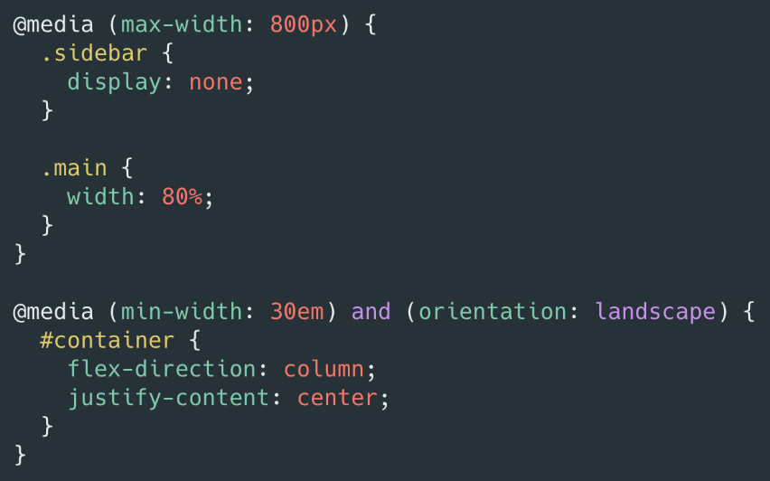

# Responsive design and CSS Media Queries

---

### The problem

As mobile devices and Desktops became widely available, developers had a problem... how do we create websites that look good on all screen sizes ?

### One approach

Early on, it was common to create separate stylesheets for different devices, or even completely different websites for each size.

### Enter responsive

These days, we tipically create ONE website and stylesheet that is able to respond to different device sizes and features.

---

## Media queries

Media queries allow us to modify our styles depending on particular parameters like screen width or device type.



---

Let's do a little guided exercise :

- Create index.html, styles.css etc. etc.
- Copy this code inside your body :

```html
<h1>I am on a :</h1>
<hr />
<h2 class="a">Mobile</h2>
<h2 class="b">Tablet</h2>
<h2 class="c">Laptop 13 inches</h2>
<h2 class="d">Laptop</h2>
<h2 class="e">Desktop</h2>
```

Instructions :

- On mobile the body should have a background `gold` and only the h2 `Mobile` should appear

- From 768px (tablet) : background : `pink` and only the h2 `Tablet` should apppear.

- From 1280px (laptop 13') : background : `chocolate` and only the h2 `Laptop 13 inches` should apppear.

- From 1440px (laptop) : background : `cadetblue` and only the h2 `Laptop` should apppear.

- From 1920px (desktop) : background : `cornflowerblue` and only the h2 `Desktop` should apppear.

Great ! Now :

- In your inspector, play with the responsiveness. Select different screen sizes and see the result. Play with the "responsive" GUI to increase and decrease the width of the viewport.

MAGIC ! The content changes relative to the viewport width !
