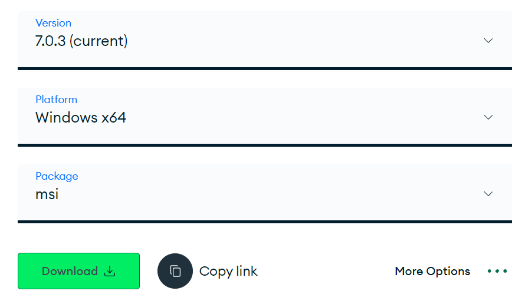
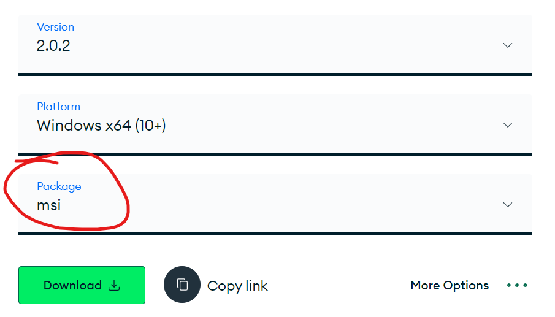

# MongoDB

---

Ok, we saw a little bit of SQL, just so you get familiarized with it because it's widely used in the field. (If later you want to go for Wordpress development it can be quite usefull, for example)

But in the Node environment, MongoDB is the way to go !

#### Why will you use MongoDB ?

First of all, we have to pick one. You will be lead to work with several databases type in your career, but here we must to choose one to go through our projects. So why MondoDB then ?

- MongoDB is very commonly used with Node and Express.
- It's easy to get started with (though it can be tricky to master)
- It plays particularly well with JavaScript.
- Its popularity also means there is a strong community of developers using Mongo.

You will be lead to learn SQL in the future, I have no doubt about it. But for now, in our projects, we just need to store data somewhere. And Mongo is a very nice way to do it.

But don't think it's a "smaller" skill to have. Big companies use it ! Google, Adobe, EA, SEGA, squarespace...

---

#### Installing MongoDB.

- Install `MongoDB Community Server `
- Install `MongoDB Shell`

These can be downloaded from [here](https://www.mongodb.com/try/download/community)

When installing it, chose the `complete` version

- Make sure you check `Install MongoD as a Service`

- Check the option to install `Mongo Compass`

MongoDB shell can be downloaded from [here](https://www.mongodb.com/try/download/shell)

- IMPORTANT : download the MSI version. Not the ZIP.

Normally you should be set now.

Go to your terminial and type `mongosh`.
You should enter the MondoDB environment. If you don't, that means it was not properly installed and you'll have to figure out why. (GIYF)
