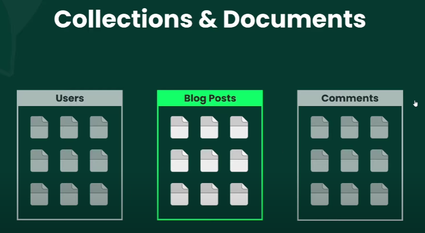
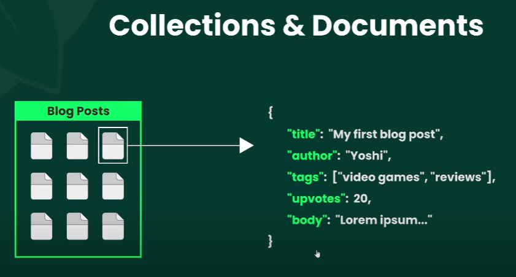
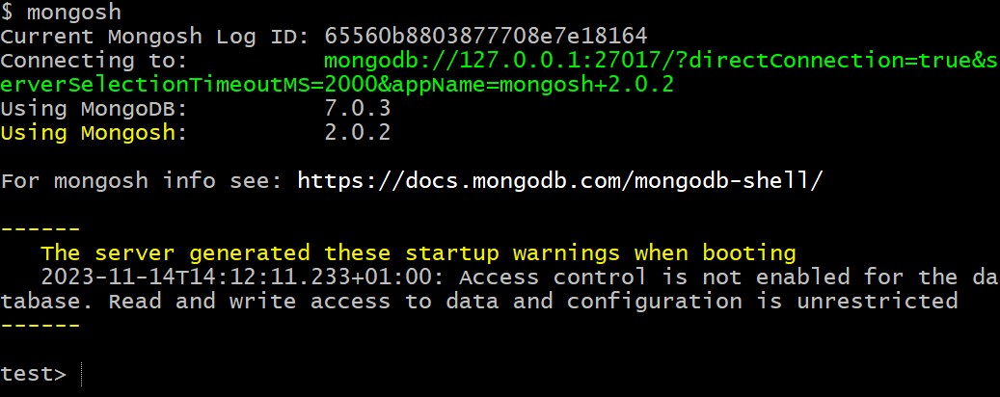

# MongoShell

---

Remember we can type `node` in our terminal and enter a Node "REPL" (an environment where we can type javascript commands and receive responses )?

You also have such a REPL for MongoDB as soon as you installed MongoDB Shell in your machine.

You just have to type `mongosh` and you enter the REPL.

From there, you are "inside" a database (initially, the database `test`). You can check all the databases that live in this server with the command `show dbs`

But first, let's understand how Mongo works in practice :

Data in Mongo are defined in a very similar way of JSON.

We just have some different names for it :

- A database has a name. For example : `blog`
- Inside of it, we have `collections`. For example : `posts`, `comments`, `users`...
- Inside of each collection we have `documents`, which are the entries themselves.

Think `collections` as arrays and each `document` as an object. It's virtually the same thing.




---

In your REPL, the cursor starts at `test`. It means you are in the database `test`. It doesn't exist yet, but the fact that you are in `test` means that if you create a collection and/or documents inside of it, the database `test` will be created automatically.



When you start the Mongo REPL, the service creates a server on a specific port and connects to it.

In the image above, you can see it connected to the newly created server at `127.0.0.1:27017`

From now on, you'll be communicating with this server to read, create, update, delete `collections` and entries (`documents`)

Here are some basic commands you'll have to understand in order to work with the Mongo database :

**Navigating**

- `show dbs` (lists all the dbs you have on your server)
- `use` (goes to the db you specify)
- `show collections` (lists all the collections you have on the current db)
- `db` (references the current database you are in)
- `clr` (clears the terminal)
- `exit` (exits the REPL)

**Creating**

In order to create a collection, run `db.articles` (`articles` being the name you want for the collection)

Then... you chain with some commands :

- `insertOne()` (Create an entry in an object format)

You just open curly braces and define the key/value pairs :

```js
db.articles.insertOne({ title: "Hello World", author: "Henrique Vieira" });
```

Now, if you enter `show collections`, you'll see the collection `articles was created`.

- `insertMany()` (same thing, but you can pass several entries - objects - in an array)

```js
db.articles.insertMany([
  { title: "Goodbye World", author: "Robin Williams" },
  { title: "What a wonderful world", author: "Louis Armstrong" },
]);
```

It's only when you create a document inside a collection that the collection is created.

Each time you create an entry, an ID from Mongo is created automatically. You don't have to specify an ID for the entry.
