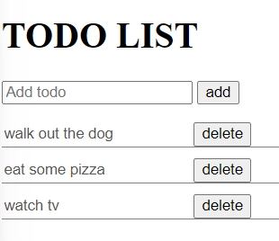

# localStorage

---

Want a liiiiitle grasp of database ?

Let's get to know what `local storage` is !

`localStorage` is an object. An object belonging to the browser (so the `window` object)

It allows you to "save" information in your browser. So, you can add key/value pairs to it and it will be store by your browser, even if you refresh it or close it.

That's a little grasp of "persistent" data. Even though that would be the last place to store data in a real life scenario.

The local storage only applies to a specific domain. If you change domain (to domain B, for example) you will get access to the local storage of this particular domain. If you come back (to domain A) you will have access to the local storage of domain A.

You can check your localStorage when you enter your developer's tool on the browser. In the section `Application`, in the left you can see the `storage` tab and inside of it `Local Storage`. If you are in a blank page that you just launched with your live-server, it should be empty.

Let's try to add something to the local storage :

In your console, enter the following commands :

```js
localStorage.setItem("fisrtName", "Obi Wan");
localStorage.setItem("lastName", "Kenobi");
```

Now go look in your application tab at what we have : two key/value pairs with the data we provided !

Now, refresh the page and see. The data is still there !

You can even close the window and stop the live server.

Now if you relaunch it and enter on port 5500 you'll see that the data is still there. Persistance !!!

Here are the commands for the local storage :

```js
localStorage.setItem("firstName", "Henrique"); // Sets the key/value pair in the local storage
localStorage.getItem("firstName"); // Returns "Henrique"
localStorage.removeItem("firstName"); // Removes the key/value pair "Henrique" from your local storage. WHY WOULD YOU DO THAT !!!???
localStorage.clear(); // Removes everyhting from you local storage.
```

With this, let's tackle a project that has never been done by any developer yet : a TODO LIST !!!!

Try to reproduce this ux :



So :

- One input where you can write the task
- A button to add it.
- Each task should occupy a row with two buttons (`delete` and `edit`)
- Of course : save it to the local storage, update the local storage and delete from it.

Small tip :

- Because you should be able to edit the task, think of making the task an input itself.

---

Done ?

**GREAT** ! Did you know you just performed your first `CRUD` operation ?

CRUD stands for **C**reate **R**ead **U**pdate and **D**elete.

These terms describe the four essential operations for creating and managing persistent data elements.
